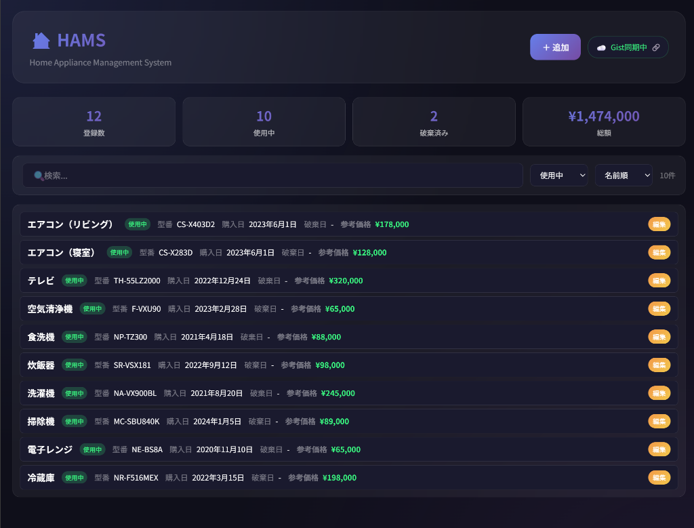

# HAMS (Home Appliance Management System)

家中の家電を管理するためのシンプルなWebアプリケーションです。



## 特徴

- **完全クライアントサイド**: サーバー不要、ブラウザだけで動作
- **GitHub Gist 同期**: クラウドに自動保存、複数デバイスで共有可能
- **自動バックアップ**: localStorageにも保存、オフラインでも動作
- **コンパクト表示**: 1行に全情報を表示、一覧性が高い
- **検索・フィルター**: 名称・型番での検索、ステータスでの絞り込み
- **モダンUI**: ダークモード、アニメーション、レスポンシブデザイン

## ファイル構成

```
hams/
├── index.html     # メインUI
├── app.js         # アプリケーションロジック
├── style.css      # スタイル
├── config.js      # 設定ファイル（.gitignore対象）
└── README.md
```

## セットアップ

### 1. config.js を作成

```javascript
const CONFIG = {
    GITHUB_TOKEN: '',  // GitHub Personal Access Token
    GIST_ID: ''        // Gist ID（初回は空でOK）
};
```

### 2. GitHub Personal Access Token を取得（オプション）

Gist同期を使う場合：

1. https://github.com/settings/tokens にアクセス
2. 「Generate new token (classic)」をクリック
3. `gist` スコープにチェック
4. トークンを生成して `config.js` に設定

### 3. ブラウザで開く

```bash
# ダブルクリックで開くか、コマンドラインから
start index.html       # Windows
open index.html        # macOS
xdg-open index.html    # Linux
```

## 使い方

| 操作 | 説明 |
|------|------|
| ＋ 追加 | 新しい家電を登録 |
| 編集 | 既存の家電情報を編集（メモもここで確認） |
| 削除 | 破棄済みの家電を削除 |
| 検索 | 名称・型番で検索 |
| フィルター | 使用中/破棄済みで絞り込み |

## データ保存

| モード | ステータス表示 | 説明 |
|--------|--------------|------|
| ローカル | 💾 ローカル保存 | トークン未設定時、localStorageのみ |
| Gist同期 | ☁️ Gist同期中 🔗 | GitHub Gistに自動保存（リンクでGist確認可能） |

## 機能一覧

- ✅ 家電の追加・編集・削除
- ✅ 名称・型番での検索
- ✅ ステータス（使用中/破棄済み）フィルター
- ✅ ソート（名前順/購入日順/価格順/登録順）
- ✅ 統計表示（登録数/使用中/破棄済み/総額）
- ✅ GitHub Gist 自動同期
- ✅ localStorage バックアップ
- ✅ レスポンシブデザイン
- ✅ ダークモード

## ライセンス

MIT
